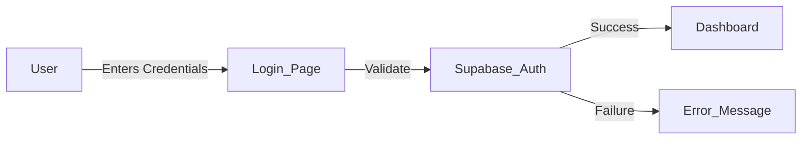

# Rehab on Wheels (ROW) - Application Architecture & Workflow

## 1. Introduction
**Rehab on Wheels (ROW)** is a comprehensive web application designed to manage and streamline community rehabilitation services. It features offline support, beneficiary tracking, service delivery logging, a token-based queue system, and real-time bus tracking.

---

## 2. High-Level Architecture

The application is built using a modern technology stack:
- **Frontend**: React (Vite), TypeScript, Tailwind CSS
- **Backend/Database**: Supabase (PostgreSQL)
- **Offline Storage**: Dexie.js (IndexedDB wrapper) for local-first data
- **State Management**: React Context & Hooks
- **Routing**: React Router DOM

---

## 3. Core Workflow Diagrams

### 3.1. User Authentication Flow

### 3.2. Beneficiary Management Flow
**Goal**: Register and manage patient data efficiently, even without internet.
1.  **Entry Point**: User navigates to **"Add Beneficiary"**.
2.  **Action**: User fills out the detailed form (Personal, Contact, Disability type).
3.  **Process**:
    *   **Offline First**: Data is immediately saved to local IndexedDB.
    *   **Sync Logic**: The app checks for internet connectivity.
    *   **Online**: Data is pushed to Supabase instantly.
    *   **Offline**: Data is marked as `pending` and synced later via the **Sync Dashboard**.
4.  **Output**: User is redirected to the **Beneficiary List**.

### 3.3. Token Management & Queue System
**Goal**: Manage daily patient queues at specific centers.
1.  **Entry Point**: User navigates to **"Token Management"** tab.
2.  **Action**: User selects a **Center** (e.g., Bangalore, Kolar).
3.  **Search**: User searches for an existing registered Beneficiary.
4.  **Generation**:
    *   System checks the last token number for *that center* on *today's date*.
    *   Generates the next sequential token (e.g., `BLR-005`).
5.  **Output**: A success modal appears displaying the **Official Token Number**.
    *   **Print Slip**: User can print a thermal receipt.
    *   **Download**: User can save the token details as a text file.
6.  **Queue Update**: The dashboard updates the "Waiting", "Completed", and "Now Serving" lists in real-time.

### 3.4. Service Delivery & Tracking
**Goal**: Log services provided and track the mobile unit.
1.  **Bus Tracking**:
    *   **Live View**: Shows current location and trip status.
    *   **Trip Entry**: Staff logs trip start/end times and odometer readings.
2.  **Service Entry**:
    *   User selects a verified **Beneficiary**.
    *   Logs the specific service type (e.g., "Physiotherapy", "Assessment").
    *   Records clinical notes and vitals.
    *   Submits the record (synced to database).

---

## 4. Module Breakdown

### A. Authentication Module
*   **Login Page**: Secure entry point.
*   **Role-Based Access Control (RBAC)**: Restricts features (e.g., Admin Control, Reports) based on user roles (Admin, Manager, Staff).

### B. Beneficiary Module
*   **Add Beneficiary**: Comprehensive registration form.
*   **Beneficiary List**: Searchable table of all patients.
*   **Profile View**: Detailed history and edit capabilities.

### C. Token Management Module
*   **Dashboard**: Shows daily stats (Total, Waiting, Completed).
*   **Live Queue**: Real-time list of patients in line.
*   **Generator**: Tool to create new tokens linked to beneficiaries.

### D. Tracking Module
*   **Live Map**: Visual representation of the bus journey.
*   **Trip Logs**: History of all trips made by the unit.

### E. Admin & Settings
*   **Sync Dashboard**: Manual controls to force-sync offline data.
*   **User Management**: create and manage staff accounts.
*   **Reports**: detailed analytics and exports.

---

## 5. Technical Data Flow

1.  **Client-Side (Browser)**:
    *   User interacts with UI components.
    *   **Dexie.js** handles immediate data persistence (CRUD).
2.  **Synchronization Layer**:
    *   Background processes monitor network status (`useOnlineStatus`).
    *   When online, pending records are batched and sent to Supabase.
3.  **Server-Side (Supabase)**:
    *   **PostgreSQL**: Relational data storage.
    *   **Edge Functions**: Handle complex triggers (like daily token resets).
    *   **Storage**: Manages file uploads (images, documents).

---

## 6. Access Control (RBAC) Hierarchy

| Role | Beneficiary | Tokens | Tracking | Admin Control |
| :--- | :---: | :---: | :---: | :---: |
| **Admin** | Full Access | Full Access | Full Access | Yes |
| **Manager** | Full Access | Full Access | Full Access | No |
| **Staff** | View/Edit | Generate | View Only | No |

---
